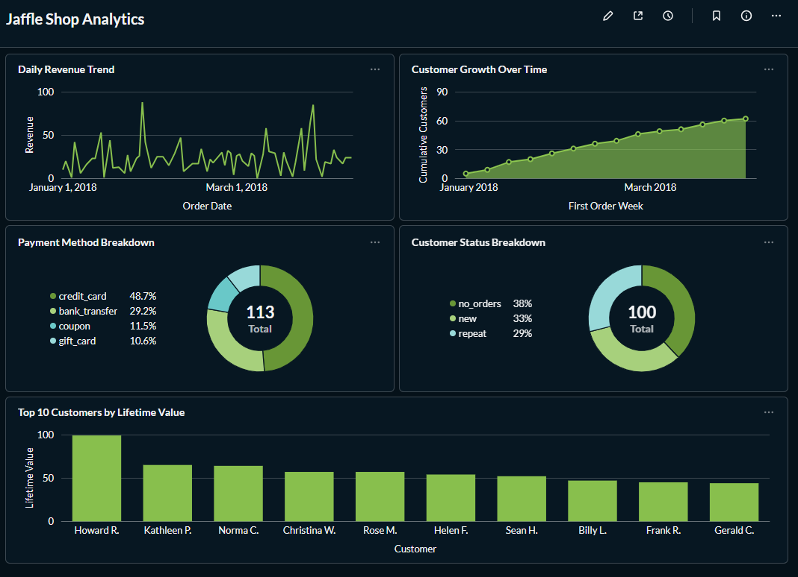
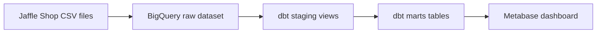
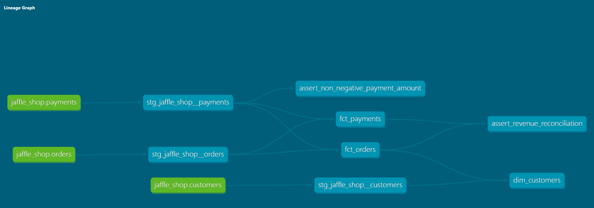

# Analytics Engineering Workflow with dbt and Metabase

An end-to-end analytics engineering project that transforms raw e-commerce data in BigQuery into tested and documented analytical models with dbt Core, then exposes the results through a Metabase dashboard.

This repository is an independent implementation of the [DataSkew Analytics Engineering Workflow with dbt + Metabase project brief](https://dataskew.io/projects/analytics-engineering-dbt/).



## Project overview

The project implements the following workflow:

1. Load raw CSV data into BigQuery.
2. Declare the BigQuery tables as dbt sources.
3. Clean and type the data through one-to-one staging models.
4. Build fact and dimension tables for analysis.
5. Validate the pipeline with generic and custom dbt tests.
6. Generate dbt documentation and lineage.
7. Visualize the resulting business metrics in Metabase.

The source data represents Jaffle Shop, a fictional e-commerce business, and contains customers, orders, and payments.

## Architecture



| Layer | Technology | Purpose |
|---|---|---|
| Raw storage | BigQuery | Store source data with minimal transformation |
| Transformation | dbt Core | Build modular SQL models and manage dependencies |
| Data quality | dbt tests | Validate keys, relationships, accepted values, and business rules |
| Documentation | dbt Docs | Document models, columns, tests, and lineage |
| Visualization | Metabase | Explore the marts and present business metrics |
| Runtime | Python and Docker | Run dbt locally and host Metabase |

## Repository structure

```text
analytics-engineering-dbt/
├── analytics_engineering/
│   ├── analyses/
│   ├── macros/
│   ├── models/
│   │   ├── staging/
│   │   └── marts/
│   ├── seeds/
│   ├── snapshots/
│   ├── tests/
│   └── dbt_project.yml
├── data/
│   └── raw/
│       ├── raw_customers.csv
│       ├── raw_orders.csv
│       └── raw_payments.csv
├── docs/
│   └── images/
│       ├── dbt_lineage.png
│       └── metabase_dashboard.png
├── compose.yml
├── requirements.txt
├── .gitignore
└── README.md
```

Generated directories, virtual environments, local credentials, and Metabase application data are excluded from version control.

## Data model

### Sources

The physical tables are stored in the BigQuery `raw` dataset and exposed to dbt through the logical source `jaffle_shop`.

| Logical source | BigQuery table | Rows |
|---|---|---:|
| `jaffle_shop.customers` | `raw.raw_customers` | 100 |
| `jaffle_shop.orders` | `raw.raw_orders` | 99 |
| `jaffle_shop.payments` | `raw.raw_payments` | 113 |

The GCP project is resolved dynamically through `target.project`, avoiding a hard-coded project ID in the source definition.

### Staging models

The staging layer contains one-to-one views over the raw sources:

- `stg_jaffle_shop__customers`
- `stg_jaffle_shop__orders`
- `stg_jaffle_shop__payments`

These models provide consistent column names, explicit data types, normalized values, trimmed text fields, and monetary values converted from cents into currency units.

### Marts

| Model | Grain | Purpose |
|---|---|---|
| `fct_orders` | One row per order | Order date, status, payment count, and total order value |
| `fct_payments` | One row per payment | Payment method and payment amount |
| `dim_customers` | One row per customer | Order history, first order date, lifetime value, and customer status |

## Lineage

The models use dbt `source()` and `ref()` functions to declare their dependencies explicitly.



The complete interactive lineage and model documentation can be generated locally with dbt Docs.

## Data quality

The project contains 64 dbt data tests covering technical constraints and business rules.

The test suite includes:

- `not_null` tests for required fields;
- `unique` tests for primary keys;
- `accepted_values` tests for controlled categorical values;
- `relationships` tests for referential integrity;
- a custom assertion preventing negative payment amounts;
- a custom reconciliation test between order revenue and payment revenue.

The custom singular tests are stored in:

```text
analytics_engineering/tests/
├── assert_non_negative_payment_amount.sql
└── assert_revenue_reconciliation.sql
```

A complete `dbt build` executes six models and 64 data tests:

```text
PASS=70
WARN=0
ERROR=0
SKIP=0
TOTAL=70
```

## Key results

| Metric | Result |
|---|---:|
| Customers | 100 |
| Customers with at least one order | 62 |
| Customers without orders | 38 |
| Customers with exactly one order | 33 |
| Repeat customers | 29 |
| Orders | 99 |
| Payments | 113 |
| Total revenue | 1,672 |
| Average order value | 16.89 |
| Orders with multiple payments | 13 |
| Maximum payments per order | 3 |
| Zero-value orders | 1 |
| Zero-value payments | 3 |

Revenue is expressed in generic currency units because the source dataset does not define a currency.

Customer status is defined as:

- `no_orders`: no orders;
- `new`: exactly one order;
- `repeat`: more than one order.

Repeat customers represent 29% of all customers and approximately 46.8% of customers who placed at least one order.

## Metabase dashboard

The dashboard contains five visualizations:

1. **Daily Revenue Trend** — daily order revenue from `fct_orders`.
2. **Customer Growth Over Time** — cumulative customers by first-order week.
3. **Payment Method Breakdown** — distribution of the 113 payment records by method.
4. **Customer Status Breakdown** — distribution across `no_orders`, `new`, and `repeat`.
5. **Top 10 Customers by Lifetime Value** — customers ranked using `dim_customers`.

Metabase runs locally through Docker Compose. Its internal metadata is stored in a Docker named volume and is intentionally not committed to Git. The dashboard screenshot and dbt models provide a portable record of the analytical output.

## Getting started

### Prerequisites

- Git;
- Python 3.10 or later;
- Google Cloud project with BigQuery enabled;
- Google Cloud CLI;
- Docker Desktop with Docker Compose;
- basic knowledge of SQL and YAML;
- basic command-line familiarity, including navigating directories, activating a virtual environment, and running CLI commands in PowerShell or an equivalent terminal.

The project was developed and tested with:

- Python 3.13.14;
- dbt Core 1.12.3;
- dbt-bigquery 1.12.0;
- Docker 29.7.2;
- Docker Compose 5.5.0.

Python 3.13.14 is the tested development version, not a strict requirement.

### 1. Clone the repository

```powershell
git clone <repository-url>
cd .\analytics-engineering-dbt
```

### 2. Create the Python environment

```powershell
python -m venv .venv
.\.venv\Scripts\Activate.ps1
python -m pip install --upgrade pip
pip install -r requirements.txt
```

The dbt dependencies are pinned in `requirements.txt` to make the environment reproducible.

### 3. Load the raw data into BigQuery

Create a BigQuery dataset named `raw` in the `EU` location and load the files from `data/raw/` into the following tables:

| File | Destination table |
|---|---|
| `raw_customers.csv` | `raw.raw_customers` |
| `raw_orders.csv` | `raw.raw_orders` |
| `raw_payments.csv` | `raw.raw_payments` |

The raw columns are initially loaded as strings. Data typing is handled in the dbt staging layer.

Expected source row counts:

```text
raw_customers: 100
raw_orders:      99
raw_payments:   113
```

### 4. Authenticate dbt

Local dbt development uses Google Application Default Credentials:

```powershell
gcloud auth application-default login
```

Create `%USERPROFILE%\.dbt\profiles.yml`:

```yaml
analytics_engineering:
  target: dev

  outputs:
    dev:
      type: bigquery
      method: oauth
      project: YOUR_GCP_PROJECT_ID
      dataset: dbt_dcdata
      location: EU
      threads: 4
      job_execution_timeout_seconds: 300
```

The profile remains outside the repository because it is specific to the local environment and may contain sensitive configuration.

### 5. Validate the connection

```powershell
cd .\analytics_engineering
dbt debug
```

A successful connection ends with `All checks passed!`.

### 6. Build and test the project

```powershell
dbt build
```

`dbt build` executes models and tests in dependency order and is the main validation command for this project.

Useful targeted commands include:

```powershell
dbt test --select "source:jaffle_shop.*"
dbt build --select path:models/staging
dbt build --select path:models/marts
```

### 7. Generate dbt documentation

```powershell
dbt docs generate
dbt docs serve
```

The generated website contains model documentation, tests, compiled SQL, and the lineage graph.

### 8. Start Metabase

Return to the repository root and start the container:

```powershell
cd ..
docker compose up -d
```

Open [http://localhost:3000](http://localhost:3000) and connect Metabase to the BigQuery `dbt_dcdata` dataset.

For this local implementation, Metabase uses a dedicated read-only service account with:

- BigQuery Job User at project level;
- BigQuery Data Viewer on `dbt_dcdata`;
- BigQuery Metadata Viewer on `dbt_dcdata`.

The service-account JSON key must be stored outside the repository and must never be committed.

Stop Metabase without deleting its saved configuration:

```powershell
docker compose stop
```

Do not run `docker compose down -v` unless the intention is to delete the Metabase volume and its locally saved metadata.

## Implementation decisions

The DataSkew brief was used as the project specification. Small deviations were made where the source data or model grain required a different implementation.

| DataSkew suggestion | Implementation | Reason |
|---|---|---|
| Load CSV files through `dbt seed` or BigQuery | Dedicated BigQuery `raw` dataset | Provides a clear separation between ingestion, sources, staging, and marts |
| Fix null customer emails | Not implemented | The selected Jaffle Shop data does not contain an email field |
| Add `is_new_customer` during staging | Customer status calculated in `dim_customers` | The value depends on order history and is not a one-to-one source attribute |
| Configure source freshness | Not implemented | Static CSV snapshots do not include an ingestion timestamp |
| Create an order heatmap by hour and weekday | Replaced with customer status breakdown | The source provides dates but no timestamps or hour information |
| Build `dim_dates` | Omitted | It is optional and the dataset covers a short date range |
| Calculate average basket size | Interpreted as average monetary order value | The source has no products, quantities, or order-line table |
| Create custom macros | No unnecessary macro introduced | The transformations remain readable without additional abstraction |

These decisions are documented explicitly rather than introducing unavailable fields or invented data.

## Security

The repository does not contain:

- `profiles.yml`;
- OAuth tokens;
- service-account JSON keys;
- environment files containing secrets;
- Metabase database files;
- Python virtual environments;
- dbt-generated artifacts.

OAuth is used for local dbt development. Metabase uses a restricted service account because its BigQuery connector requires service-account credentials in this local setup. A production implementation should prefer short-lived or keyless authentication where supported.

## Troubleshooting

### `python` command not recognized

Depending on the Windows and Python installation, the Python launcher may be available as `py` instead of `python`.

```powershell
py --version
py -m venv .venv
py -m pip install --upgrade pip
```

After activating the virtual environment, the `python` command should normally become available:

```powershell
.\.venv\Scripts\Activate.ps1
python --version
```

## Credits and attribution

### DataSkew

The project scope, learning objectives, suggested architecture, and delivery requirements are based on:

[Analytics Engineering Workflow with dbt + Metabase — DataSkew](https://dataskew.io/projects/analytics-engineering-dbt/)

This repository is an independent educational implementation created for a DataSkew portfolio submission. DataSkew did not author the implementation contained in this repository.

### Jaffle Shop

The sample customers, orders, and payments data is derived from:

[dbt Labs — jaffle-shop-classic](https://github.com/dbt-labs/jaffle-shop-classic)

Jaffle Shop is a fictional e-commerce dataset created by dbt Labs to demonstrate and test dbt concepts. The original repository is distributed under the [Apache License 2.0](https://github.com/dbt-labs/jaffle-shop-classic/blob/main/LICENSE).

The SQL transformations, dbt tests, BigQuery configuration, Docker Compose setup, documentation, analysis, and Metabase dashboard in this repository are part of this independent implementation.
